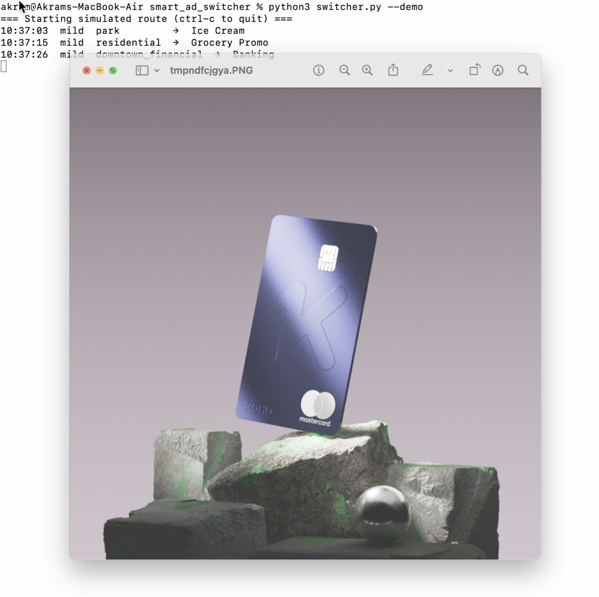

# 🚛  Smart Ad Switcher

A simple Python + Raspberry Pi demo that automatically switches digital ads based on **location, time, and weather**.  
Built for showcasing intelligent ad-serving concepts without complex hardware setups.


📂 Project Structure
```
smart_ad_switcher/
├── ads/ # Contains all ad images
│ ├── ice_cream_hot.jpg
│ ├── winter_jacket_cold.jpg
│ ├── family_event_residential.jpg
│ └── generic_brand.jpg
├── rules.json # Ad rules for weather/time/location
├── switcher.py # Main Python script
└── README.md # Project documentation
```


Features

- Weather-aware ads → Show hot/cold/mild ads depending on temperature.  
- Location-based logic → Simulates moving between *Downtown*, *Residential*, *Park*, and *University*.  
- Time-sensitive rules → Different ads for day and evening hours.  
- Demo-friendly → Runs without real GPS by generating fake route data.  
- Easily expandable → Add more ad categories, sensors, or AI-driven targeting.

---
 How to Run

1. Install Dependencies
  ``` pip install pillow requests ```

2. Run in Demo Mode
```python3 switcher.py --demo```
Simulates random movement across areas.

Displays corresponding ad images based on rules.json.

3. Single Location Test
```python3 switcher.py --lat 43.65 --lon -79.38```


## 🎥 Demo

[](demo/demo.mp4)

> Click the image above to watch the full demo (MP4).


 Rules (rules.json)
Example rule format:
```
json

[
  {
    "name": "Hot Ice Cream",
    "file": "ice_cream_hot.jpg",
    "weather": ["hot"],
    "hour_range": [12, 18],
    "area": ["park", "downtown"]
  }
]
```
Each ad is triggered by:
- Weather: hot | mild | cold
- Hour range: [start_hour, end_hour]
- Area: downtown | residential | park | university

 Future Ideas
- Integrate real GPS via Raspberry Pi and USB GPS dongle.
- Add camera or sensors for detecting traffic or people density.
- Future iteration could incorporate real-time traffic data, local event APIs, or even demographic data to make smarter decisions.
- Use AI/ML to predict best ad for a given route or event.
- Connect to cloud dashboards for analytics and ad reporting.
